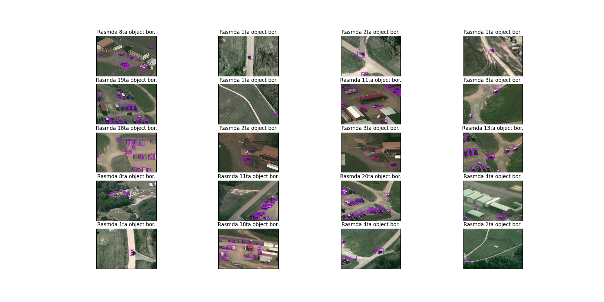
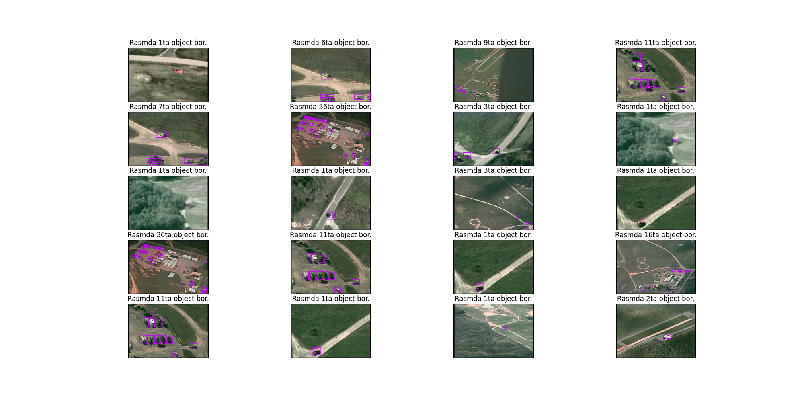
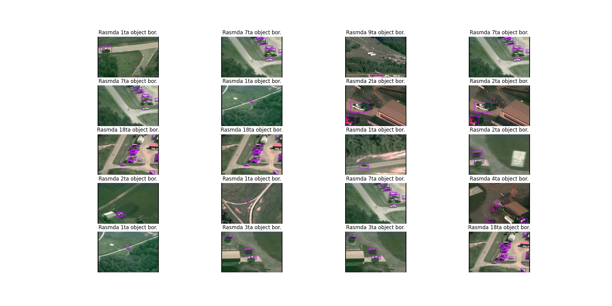
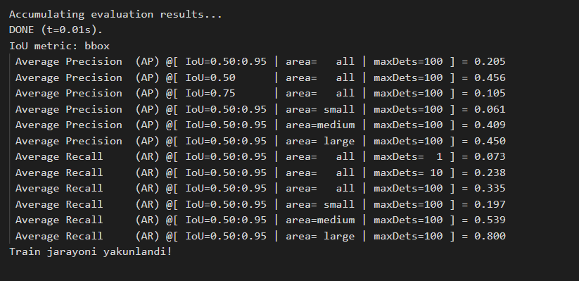
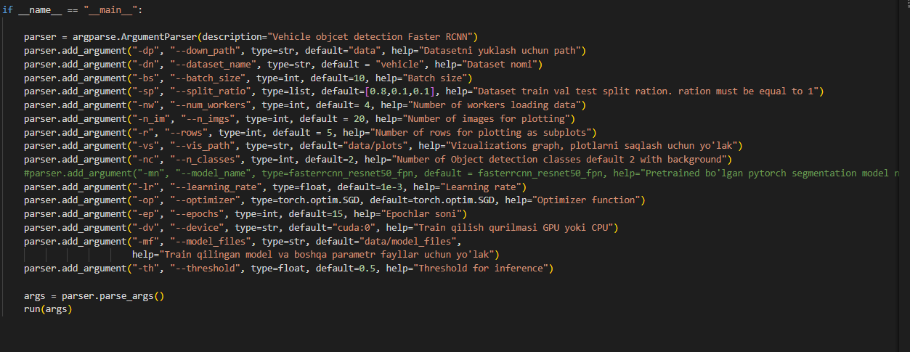
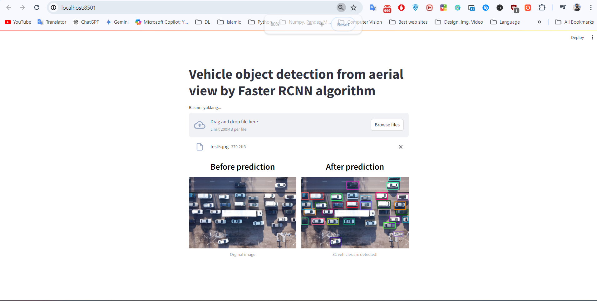

# Vehicle object detection Faster RCNN

## Project Overview
This project is purposed to detect vehicles from aerial view of camera.  
## Installation

To set up the project environment:
#### 1-method

```bash
git clone https://github.com/cengineer13/Vehicle-detection-from-aeral-view-Faster-RCNN.git
cd Vehicle-detection-from-aeral-view-Faster-RCNN
pip install -r requirements.txt
```

#### 2-method

Create conda environment using two methods:

a) Create a virtual environment using yml file:

```python
conda env create -f environment.yml
```

Then activate the environment using the following command:
```python
conda activate ds
```

b) Create a virtual environment using txt file:

- Create a virtual environment:

```python
conda create -n ds python=3.10
```

- Activate the environment using the following command:

```python
conda activate ds
```

- Install libraries from the text file:

```python
pip install -r requirements.txt
```

## Dataset
* Download dataset from the [link](https://www.kaggle.com/datasets/killa92/vehicle-detection-dataset).
  

* This dataset contains vehicle images for object detection task. For training purposes, it should be split into three sets necessary for Machine Learning and Deep Learning tasks, namely train, validation, and test splits. The structure of the data is as follows:
  


ROOT

images:
- img_file;
- img_file;
- img_file;
- ……..
- img_file.

labels:
- txt_file;
- txt_file;
- txt_file;
- ……..
- txt_file.

For the object detection task, the bounding box coordinates can be obtained using txt files from the labels folder.

<h4 align="center"> Training dataset examples</h4>



<h4 align="center"> Validation dataset examples</h4>



<h4 align="center"> Test dataset examples</h4>



These images are random visualizations from the training, validation, and test sets.

## Model Performance

The model's training and validation Precision, Recal and MIoU metrics:



  ### Average Precision (AP):

AP@[IoU=0.50:0.95 | area=all | maxDets=100] = 0.205: This is the mean Average Precision (mAP) across IoU thresholds ranging from 0.50 to 0.95, calculated for all object sizes, considering up to 100 detections. An AP of 0.205 indicates the model's overall precision-recall performance.
AP@[IoU=0.50 | area=all | maxDets=100] = 0.456: This is the precision at an IoU threshold of 0.50 for all object sizes. A value of 0.456 suggests that the model performs reasonably well at this IoU threshold.
AP@[IoU=0.75 | area=all | maxDets=100] = 0.105: This is the precision at an IoU threshold of 0.75 for all object sizes, indicating stricter localization accuracy. A value of 0.105 shows the model struggles more with stricter localization.
AP@[IoU=0.50:0.95 | area=small | maxDets=100] = 0.061: This is the mAP for small objects, indicating lower performance (0.061) on smaller objects.
AP@[IoU=0.50:0.95 | area=medium | maxDets=100] = 0.409: This is the mAP for medium-sized objects, with a relatively higher value (0.409).
AP@[IoU=0.50:0.95 | area=large | maxDets=100] = 0.450: This is the mAP for large objects, showing the best performance (0.450) among different object sizes.

### Average Recall (AR):

AR@[IoU=0.50:0.95 | area=all | maxDets=1] = 0.188: This is the average recall when only considering the top 1 detection per image.
AR@[IoU=0.50:0.95 | area=all | maxDets=10] = 0.238: This is the average recall when considering the top 10 detections per image.
AR@[IoU=0.50:0.95 | area=all | maxDets=100] = 0.335: This is the average recall when considering up to 100 detections per image.
AR@[IoU=0.50:0.95 | area=small | maxDets=100] = 0.197: This is the average recall for small objects, showing the model's ability to detect smaller objects (0.197).
AR@[IoU=0.50:0.95 | area=medium | maxDets=100] = 0.539: This is the average recall for medium-sized objects, indicating better performance (0.539).
AR@[IoU=0.50:0.95 | area=large | maxDets=100] = 0.800: This is the average recall for large objects, showing the best recall performance (0.800) among different object sizes.

## Inference

Here's how the model performs on the test set:


### Arguments for training 
* Train the model using the following arguments:



```python

python main.py  --batch_size 32 --epochs 15

```


## Testing on New Data &  Interactive Web Demo

A Streamlit web app (`demo.py`) allows users to upload an image and receive model predictions in a user-friendly interface. Hence, We utilized streamlit user interface web application to demonstrate how is working our model. Among .py files demo.py file need to be run by as streamlit run demo.py and here we go

```bash
streamlit run demo.py
```
Result: 


To evaluate the model on new, I used this unseen images:
These are examples of new data images passed through the model. 


By the way we can control the threshold value which services to get rid of lower score object detection namely bounding boxes. In data/test-images folder we can testify our model it is being evaluated by few test never seen before data 


## Contributing

We welcome contributions from the community. Please read the contributing guidelines first before making a pull request.

## License

This project is licensed under the MIT License - see [LICENSE.md](LICENSE.md) for details.

## Contact

Mr Murodil  - murodild@gmail.com <br>
LinkedIn - https://www.linkedin.com/in/mr-murodil<br>
Project Link: [https://github.com/cengineer13/Vehicle-detection-from-aeral-view-Faster-RCNN](https://github.com/cengineer13/Vehicle-detection-from-aeral-view-Faster-RCNN.git)
